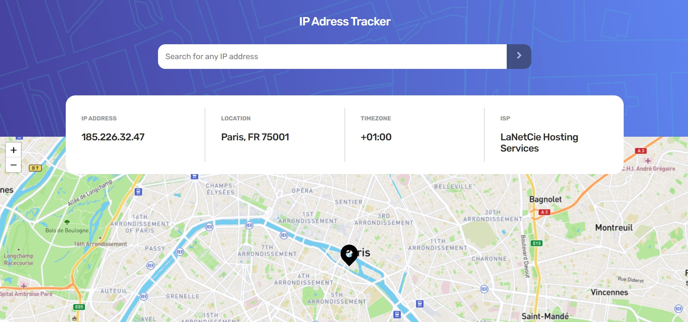

[View live site](https://kilelx.github.io/IP-Address-Tracker/)

# Frontend Mentor - IP address tracker solution

This is a solution to the [IP address tracker challenge on Frontend Mentor](https://www.frontendmentor.io/challenges/ip-address-tracker-I8-0yYAH0). Frontend Mentor challenges help you improve your coding skills by building realistic projects. 

## Table of contents

- [Overview](#overview)
  - [The challenge](#the-challenge)
  - [Screenshot](#screenshot)
  - [Links](#links)
- [My process](#my-process)
  - [Built with](#built-with)
  - [What I learned](#what-i-learned)
- [Author](#author)

## Overview

### The challenge

Users should be able to:

- View the optimal layout for each page depending on their device's screen size
- See hover states for all interactive elements on the page
- See their own IP address on the map on the initial page load
- Search for any IP addresses or domains and see the key information and location

### Screenshot

### Links

- Solution URL: [View live site](https://kilelx.github.io/IP-Address-Tracker/)

## My process

### Built with

- HTML5
- CSS3
- JavaScript

### What I learned

My first project using an API (even two!). I faced some difficulties about the default_ip , due to a misunderstanding on the documentation. Except that, I progressed step by step, and everything went well :)

## Author

- Website - [Kieran LELEUX](http://www.kieran-leleux.com)
- Frontend Mentor - [@kilelx](https://www.frontendmentor.io/profile/kilelx)
